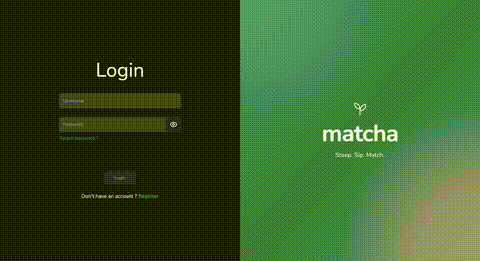
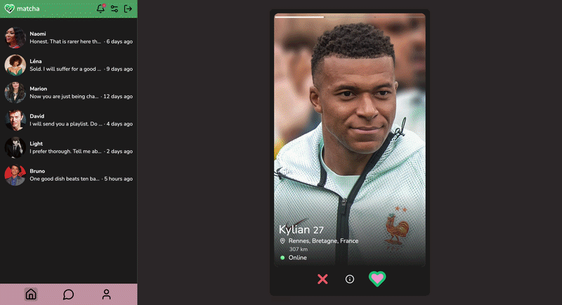
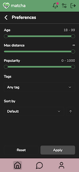
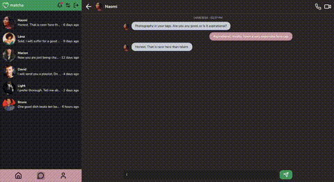
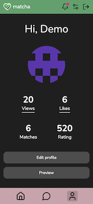

<div align="center">
	
</div>

<h1 align="center">
	Lien
</h1>
<p align="center">
	https://matcha.ilandols.com/
</p>

## Description
<p align="center">
	Fatigué de swiper dans le vide ? Matcha te propose des profils qui te correspondent vraiment, à quelques mètres de chez toi.<br>Ce projet, a été réalisé dans le cadre du cursus de l'école 42.
</p>

## Installation en local

- Étape 1 : Installer et lancer Docker [Documentation](https://docs.docker.com/engine/install/)

- Étape 2 : Clone le projet et renomme les deux fichiers ".env.example" en ".env". Tu les trouveras dans les dossiers "back" et "front". La plupart des variables sont déjà remplies, mais il est recommandé de les remplacer par tes propres valeurs. Attention cependant aux variables `AWS_*` et `MAILER_*` du back : celles-ci ne sont pas fournies, car elles nécessitent respectivement un bucket S3 (stockage des photos) et un compte SMTP (envoi des emails d'activation et de réinitialisation de mot de passe) que tu devras te procurer toi-même.

- Étape 3 : Dans un terminal, place-toi dans le dossier du projet et exécute :
```bash
docker compose up --build
```

Une fois le build terminé, l'app tourne sur localhost:5173.

- Étape 4 (optionnelle) : Pour éviter de démarrer sur une app vide, tu peux peupler la base avec quelques centaines de faux profils :
```bash
docker compose exec back npm run seed:dev
```

# Features

## Matching
<div align="center">
	
</div>
<p align="center">
	Une fois ton profil créé, découvre une pile de profils suggérés rien que pour toi. L'algorithme mixe ta localisation, tes centres d'intérêt en commun et la popularité de l'autre pour te proposer les meilleurs matchs en premier. Swipe à droite si ça t'intéresse, et croise les doigts pour le match !
</p>

## Filtrage
<table align="center">
	<tr>
		<td></td>
		<td width="480">Pas convaincu par les suggestions ? Prends les choses en main avec la recherche avancée, et filtre les profils par âge, distance, fame rating ou centres d'intérêt communs pour trouver exactement ce que tu cherches.</td>
	</tr>
</table>

## Chat
<div align="center">
	
</div>
<p align="center">
	C'est un match ! Reste plus qu'à briser la glace. Chaque match débloque une conversation en temps réel, pour ne jamais rater une réponse, où que tu sois sur l'app.
</p>

## Fame rating
<table align="center">
	<tr>
		<td width="480">Chaque utilisateur a un fame rating, un score inspiré du classement Elo qui monte à chaque like et descend à chaque dislike. Plus tu es populaire, plus tu remontes dans les suggestions des autres !</td>
		<td></td>
	</tr>
</table>

